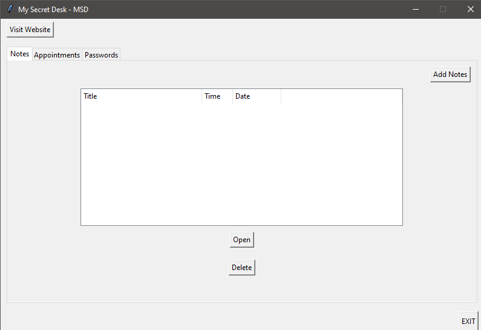

_My Secret Desk_ is an open-source desktop application. It is built to save your notes, appointments, and passwords in your local harddrive. 

The desktop application lets you gain complete control over your important and sensitive data that you worry to store in a third-party application or online to access without internet. 

This application is completely free to use and doesn't require an active internet connection to work. To view the source code click on the button "View On GitHub". 

One sample screenshot is attached below:

I admit that the application is looking pale with poor designs. But, I had focused more on the user data protection rather than good looking designs. 

Your private data is completely safe and secure until you expose your **Private Key** to other users. 

You can generate your private key [here](https://kiranendra.github.io/keygen/). The key generation webpage is open-source too.

Follow the instructions carefully given in the _Readme_ file which is available to download and also provided within the zip file.

### Pros and Cons

For your better understanding I have provided the pros and cons of using the application.

| PROS        | Summary          |
|:-------------|:------------------|
| Free and Open-Source | This applciation is free to use and open-source (nothing is hidden from your eyes - except the cipher which works on encryption and decryption of the data) |
| Simple UI to understand | The UI is very simple to use and understand |
| No Internet Required | The application works without internet. However, two functionalities require internet. You will know them when you are using it. |
| Privacy | As I mentioned earlier your data is completely secure and is in your hands. |
| No Install Required | The application does not require any installation. Just download the zip extract it and use it. |

| CONS        | Summary          |
|:-------------|:------------------|
| UI | Although the UI is simple it lacks beauty (since I used only Tkinter-Python) |
| Data | Your data is in your hands. Your data is only secure until you keep your `key` safe and hidden. |
| Data | Your data is in your hands. Your data is only secure until you keep your `key` safe and hidden. |
| Updates | Since it is not being installed, updating the application is little tricky. But, I will give instructions for every update. |

### Contact

Visit my [Portfolio](https://kiranendra.github.io/) to know about me a little.

For any issues/feature requests in the application click [here](https://github.com/Kiranendra/my-secret-desk-desktop/issues).

For feedback/suggestions/others mail me at `k.develop.k@gmail.com` with appropriate subject.

If you like this project please give a star in GitHub and share this to reach as far as possible.

**Thank You for visiting**